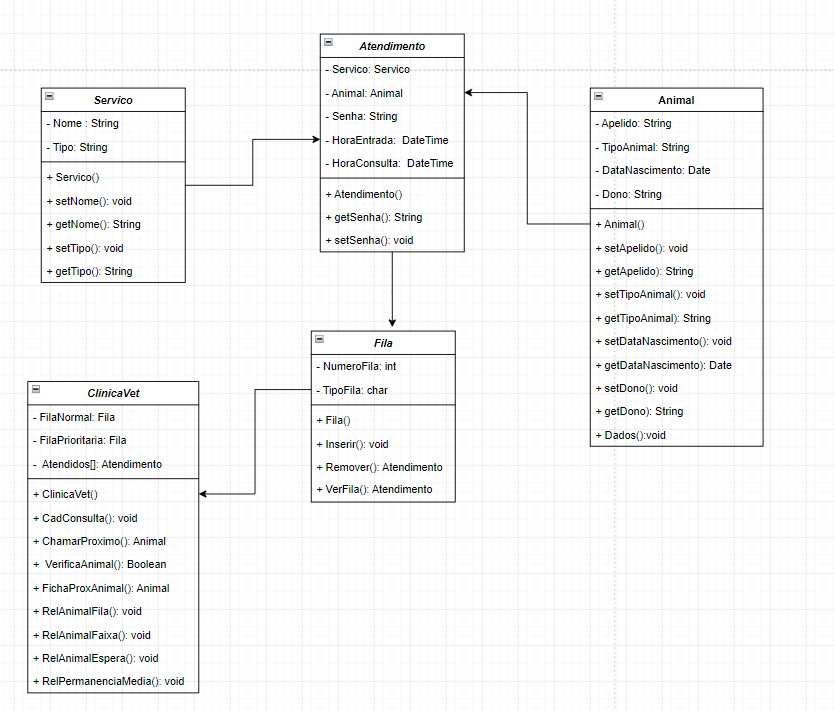

 ## 💻Como rodar esse Projeto
Projeto que simula um sistema de ordenação de filas em uma clinica veterinária.

## 💻Tecnologias Utilizadas
- Linguagem de Programação JAVA
- Editor de Código Fonte:  
 Eclipse  
 Vscode

 ## 💻Diagrama de Classe do Projeto 

 ## 💻Como rodar esse Projeto
~~~
git clone https://github.com/Gabidiela/ClinicaVeterinaria.git 
~~~
  

  Feito com muito ❤

